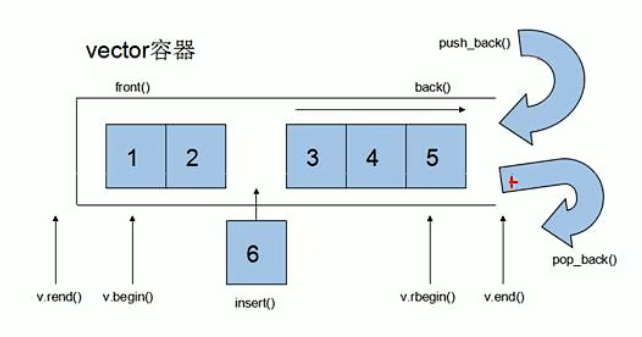
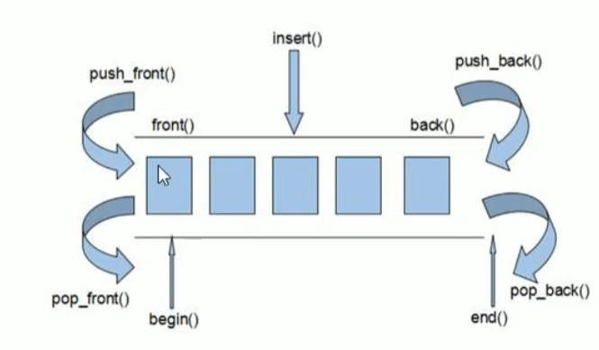
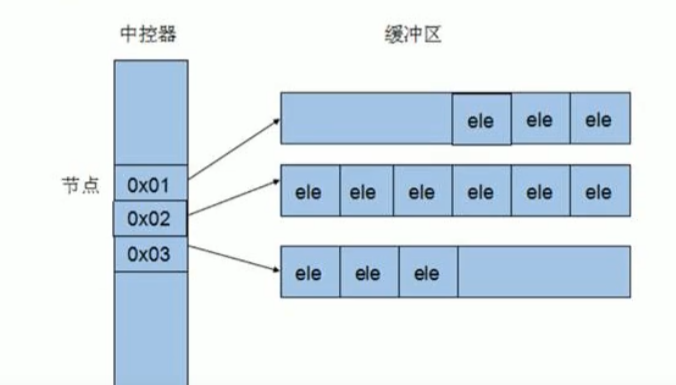
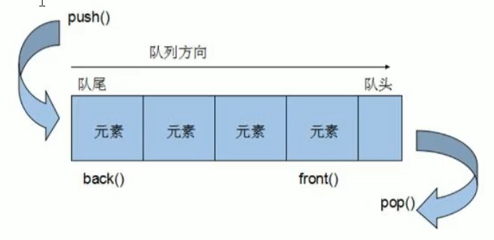
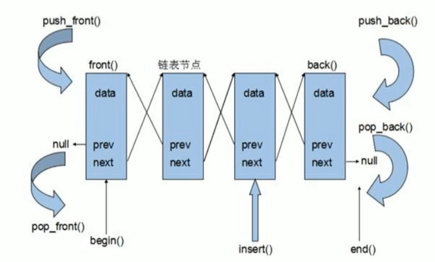

# C++提高编程
本阶段主要针对C++泛型编程和STL技术做详细讲解，探讨C++更深层的使用

## 模板
**概念:** 模板就是建立**通用的模具**，大大**提高复用性**

**内容:**
 * 函数模板
 * 类模板

### 函数模板
**作用:** 建立一个通用的函数，其函数返回值类型和形参可以不具体制定，用一个虚拟的类型来代表

**语法:** ``template<typename T> 函数声明或定义``

```c++
void swapInt(int &a, int &b) {
    int temp = a;
    a = b;
    b = temp;
}

void swapDouble(double &a, double &b) {
    double temp = a;
    a = b;
    b = temp;
}

template<typename T> //声明一个模板，让编译器后面紧跟着的T不要报错
void swap(T &a, T &b) {
    T temp = a;
    a = b;
    b = temp;
}

int main() {

    int a = 10;
    int b = 20;

    //1.自动推导
    mySwap(a, b);

    //2. 显示类型推导
    mySwap<int>(a, b);
}
```

**注意事项:**
 * 自动类型推导，必须推导出一致的数据类型T才可以使用
 * 模板必须要确定出T的数据类型，才可以使用

```c++
template<class T> //可以用class替换
void swap(T &a, T &b) {
    T temp = a;
    a = b;
    b = temp;
}

template<class T>
void func() {
    cout << "func 调用" << endl;
}

void test01() {
    func(); //错误，木板必须确定出T的数据类型，才可以使用 
    func<int>();
}

int main() {

    int a = 10;
    int b = 20;
    char c = 'c';

    //1.自动推导
    mySwap(a, b);
    //mySwap(a, c); //T具体类型不一致

    //2. 显示类型推导
    mySwap<int>(a, b);
}
```

**案例:**
```c++
//选择排序

template<class T>
void swap(T &a, T&b) {
    T temp = a;
    a = b;
    b = temp;
}

template<class T>
void printArray(T arr[], int len) {

    for (int i = 0; i < len; i++) {

        cout << arr[i] << endl;
    }
}

template<class T>
void selectSort(T arr[], int len) {

    for (int i = 0; i < len; i++) {
        int max = arr[i];
        for (int j = i+1; j < len; j++) {
            if (arr[max] < arr[j]) {
                max = j;
            }
        }
        swap(arr[i], arr[max]);
    }
}
```

### 普通函数与函数模板区别:
 * 普通函数调用可以发生隐式类型转化
 * 函数模板使用自动类型推导，不可以发生隐式类型转化
 * 函数模板用显示指定类型，可以发生隐式类型转化

```c++
template<class T>
T add(T a, T b) {

    return a + b;
}

void test01() {

    int a = 10;
    int b = 20;
    char c = 'c'

    cout << add(a, c) << endl; //错误

    cout << add<int>(a, c) << endl; 
}
```

### 普通函数与函数模板的调用规则

**规则:**
 * 如果函数模板和普通函数都可以实现，优先调用普通函数
 * 可以通过空模板参数列表来强制调用函数模板
 * 函数模板也可以发生重载
 * 如果函数模板可以产生更好的匹配，优先调用函数模板
```c++
void myPrint(int a, int b) {
    cout << "调用普通函数" << endl;
}

template<class T>
void myPrint(T a, T b) {
    cout << "调用函数模板" << endl;
}

void test01() {

    int a = 10;
    int b = 10;
    myPrint(a, b);

    myPrint<>(a, b); 
}
```

### 模板的局限性
```c++
// 模板的局限性
// 模板不是万能的，有些特殊类型需要具体化实现方式

class Person {

public:
    Person(string name, int age) {
        m_Name = name;
        m_Age = age;
    }

    string m_Name;
    int m_Age;
}

template<class T>
bool compare(T &a, T &b) {
    if (a == b) {
        return true;
    } 
    else {
        return false;
    }
}

//利用具体化Person的版本实现代码
template<> bool compare(Person &p1, Person &p2) {
    if (p1.m_Name == p2.m_Name && p1.m_Age == p2.m_Age){
        return true;
    }
    else {
        return false;
    }
}

void test01() {
    Person p1("Tom", 10);
    Person p2("Tom", 10);

}

```

### 类模板
**语法:** ``template<typename T> 类``
```c++
template<class NameType, class AgeType>
class Person{

public:
    Person(NameType name, AgeType age){
        m_Name = name;
        m_Age = age;
    }

    NameType m_Name;
    AgeType m_Age;
};

void test01() {
    Person<string, int> p1("孙悟空", 34);
}
```

**类模板和函数模板的区别**
 * 类模板没有自动类型推导的使用方式
 * 类模板在模板参数列表中有默认参数

```c++
template<class NameType, class AgeType=int>
class Person{

public:
    Person(NameType name, AgeType age){
        m_Name = name;
        m_Age = age;
    }

    NameType m_Name;
    AgeType m_Age;
};

void test01() {

    //错误，无法自动推导
    Person p1("孙悟空", 34);

    Person<string> p1("孙悟空", 34);
}
```

**类模板中成员函数的创建时机**
 * 普通类中的成员函数一开始就可以创建
 * 类模板中的成员函数在调用时才创建

**类模板对象做函数参数**

传入方式:
 * 指定传入的类型  --直接显示对象的数据类型
 * 参数模板化      --讲对象中的参数变为模板进行传递
 * 整个类模板化    --将这个对象类型 模板化进行传递

```c++
template<class T1, class T2>
class Person
{
public:
    Person(T1 name, T2 age) {
        this->m_Name = name;
        this->m_Age = age;
    }

    void showPerson(){
        cout << "姓名: " << this->m_Name << "年龄:" <<this->m_Age << endl;
    }

    T1 m_Name;
    T2 m_Age;
};

//指定传入的类型 
void printPerson(Person<string, int> &p) {
    p.showPerson();
}

//参数模板化 
template<class T1, class T2>
void printPerson(Person<T1, T2> &p) {
    p.showPerson();
    cout << typeid(T1).name << endl;
    cout << typeid(T2.name << endl;
}

//整个类模板化
template<class T>
void printPerson(T &p) {
    p.showPerson();
}

void test01() {
    Person<string, int> p("孙悟空"， 100)；
    printPerson(p);
}
```

**类模板与继承**

当模板遇到继承时，需注意:
 * 当子类继承的父类是一个类模板时，子类在声明的时候，要指定出父类中T的类型
 * 如果不指定，编译器无法给子类分配内存
 * 如果想灵活指定出父类中T的类型，子类也需变为类模板

```c++
template<class T>
class Base {
    T m;
};

//需要确定父类的参数类型
class Son : public Base<int> {

};

template<class T1, class T2>
class Son2 : public Base<T2> {
    
    T1 obj;
};
```

**类模板成员函数的类外实现**
```c++
template<class T1, class T2>
class Person {

public:
    Person(T1 name, T2 age);

    void showPerson();

    T1 m_Name;
    T2 m_Age; 
};

//构造函数的类外实现
template<class T1, class T2>
Person<T1, T2>::Person(T1 name, T2 age) {
    this->m_Name = name;
    this->m_Age = age;
}

template<class T1, class T2>
void Person<T1, T2>::showPerson() {
        cout << this->m_Name << this->m_Age << endl;
    }
```

**类模板分文件编写**

问题: 类模板中成员函数创建时机是在调用阶段，导致分文件编写时连接不到

解决: 
 * 直接包含.cpp源文件
 * 将声明和实现写到同一个文件中，然后更改后缀名为.hpp，约定名称中

```c++
//person.h
#pragma once
#include<iostream>
using namespace std;
#include<string>

template<class T1, class T2>
class Person {

public:
    Person(T1 name, T2 age);

    void showPerson();

    T1 m_Name;
    T2 m_Age; 
};

```

```c++
//person.cpp
#include"person.h"

template<class T1, class T2>
Person<T1, T2>::Person(T1 name, T2 age) {
    this->m_Name = name;
    this->m_Age = age;
}

template<class T1, class T2>
void Person<T1, T2>::showPerson() {
        cout << this->m_Name << this->m_Age << endl;
    }
```

```c++
#include"person.cpp"

int main() {

    Person<string, int> p("孙悟空". 546);
    p.showPerson();

    return 0;
}
```


声明与实现写在一块:
```c++
//person.hpp
#pragma once
#include<iostream>
using namespace std;
#include<string>

template<class T1, class T2>
class Person {

public:
    Person(T1 name, T2 age);

    void showPerson();

    T1 m_Name;
    T2 m_Age; 
};

//构造函数的类外实现
template<class T1, class T2>
Person<T1, T2>::Person(T1 name, T2 age) {
    this->m_Name = name;
    this->m_Age = age;
}

template<class T1, class T2>
void Person<T1, T2>::showPerson() {
        cout << this->m_Name << this->m_Age << endl;
    }
```

**类模板与友元**

全局函数类内实现 - 直接在类内声明友元即可
全局函数类外实现 - 需要提前让编译器知道全局函数的实现

```c++
#include<string>

template<class T1, class T2> class Person;

template<class T1, class T2>
void printPerson1(Person<T1, T2> p) {
        cout << p.m_Name << p.m_Age << endl;
    }

//全局函数配合友元 类外实现 先做函数模板声明， 下方再做函数模板定义，在做友元
template<class T1, class T2> 
class Person{

    //全局函数类内实现
    friend void printPerson(Person<T1, T2> p) {
        cout << p.m_Name << p.m_Age << endl;
    }

    //全局函数类外实现, 需要加空参数列表
    //同时需要让编译器提前知道这个函数的存在
    friend void printPerson1<>(Person<T1, T2> p);

public:
    Person(T1 name, T2 age) {
        this->m_Name = name;
        this->m_Age = age;
    }

private:
    T1 m_Name;
    T2 m_Age;
}
```
## STL初识
### STL的诞生
 * 长久以来，软件界一直希望建立一种可重复利用的东西
 * C++的**面相对象**和**泛型编程**思想，目的就是**复用性的提升**
 * 为了建立数据结构和算法一套标准，诞生了STL

### STL基本概念
 * STL(Standard Template Library, 标准模板库)
 * STL从广义上分为: 容器(container) 算法(algorithm) 迭代器(iterator)
 * **容器**和**算法**之间通过**迭代器**进行无缝连接
 * STL几乎所有的代码都采用了模板类或模板函数

### STL六大组件
容器、算法、迭代器、仿函数、适配器、空间配置器

容器: 各种数据类型 如vector、list、deque、set、map

算法: 常用的各种算法，如sort、find、copy、for_each等

迭代器: 扮演了容器和算法之间的胶合剂

仿函数: 行为类似函数，可作为算法的某种策略

适配器: 一种用来修饰容器或仿函数或迭代器接口的东西

空间适配器: 负责空间的配置和管理

### STL中容器、算法、迭代器

**容器**: 置物之所也

STL容器就是将运用最广泛的一些数据结构实现出来

常用的数据结构: 数组、链表、树、栈、队列、集合、映射表等

这些容器又分为**序列式容器**和**关联式容器**两种:
 * 序列式容器:强调值的排序，序列式容器中的每个元素均有固定的位置
 * 关联式容器: 二叉树结构，各元素间没有严格物理上的顺序关系

**算法**: 问题之解法也

有限的步骤，解决逻辑或数学上的问题，这一门学科我们叫做算法(Algorithms)

算法分为: **质变算法** 和 **非质变算法**

质变算法: 运算过程中会更改区间内的元素内容.
非质变算法: 运算过程中不会更改区间内的元素内容，查找、计数、遍历、寻找极值

**迭代器**: 容器和算法之间的粘合剂

提供一种能够义序寻访某个容器所含的各个元素，而又无需暴露容器内不表示方式

迭代器使用非常类似于指针，可以先理解为指针

|种类|功能|支持运算|
|-|-|-|
|输入迭代器|对数据的只读访问|只读，支持++、==、！=|
|输出迭代器|对数据的只写访问|只写，支持++|
|前向迭代器|读写操作，并能向前对进迭代器|读写，支持++、==、！=|
|双向迭代器|读写操作、并能向前和向后操作|读写，支持++、--|
|随机访问迭代器|读写操作、并能跳跃的方式访问任意数据，功能最强的迭代器|读写，支持++、--、[n]、-n、<、<=、>、>=|

### 容器算法迭代器初始

**vector存放内置数据类型**

容器：``vector``

算法: ``for_each``

迭代器: ``vector<int>::iterator``

```c++
#include<iostream>
using namespace std;
#include<vector>
#include<Algorithm>

void myPrint(int val) {
    cout << val <<endl;
}

void test01() {

    vector<int> v;

    v.push_back(10);
    v.push_back(11);
    v.push_back(12);
    v.push_back(13);

    vector<int>::iterator itBegin = v.begin(); //起始迭代器 指向容器中第一个元素
    vector<int>::iterator itEnd = v.end();//结束迭代器，指向容器中最后一个元素的下一个位置

    while (itBegin != itEnd) {

        cout << *itBegin << endl;
        itBegin++;
    }

    for (vector<int>::iterator it = v.begin(); it != v.end(); it++) {
        cout << *itBegin << endl;
    }

    for_each(v.begin(), v.end(), myPrint);
}
```

**vector容器存放自定义类型**

```c++
#include<vector>

class Person {

public: 
    Person(string name, int age) {
        m_Name = name;
        m_Age = age;
    }

    int m_Age;
    string m_Name; 
}

int main() {

    vector<Person> v;
    for (int i = 0; i < 10; i++) {
        Person p("张三", i);
        v.push_back(p);
    }

    for (vector<Person>::iterator it = v.begin(); it != v.end(); it++) {
        cout << (*it).m_Age << endl;
    }

    return 0;
}
```

**vector容器嵌套**
```c++
#include<vector>

void test01() {

    vector< vector<int> > v;

    vector<int> v1;
    vector<int> v2;
    vector<int> v3;
    vector<int> v4;

    for (int i = 0; i < 4; i++) {
        v1.push_back(i);
        v2.push_back(i+10);
        v3.push_back(i+20);
        v4.push_back(i+30);
    }

    v.push_back(v1);
    v.push_back(v2);
    v.push_back(v3);
    v.push_back(v4);

    for (vector< vector<int> >::iterator it = v.begin(); it != v.end(); it++) {
        vector<int> subv = *it;
        for (vector<int>::iterator subit = subv.begin(); subit != subv.end(); subit++) {
            cout << *subit << " ";
        }
        cout << endl;
    }
}
```

## 常用容器

### string
**本质:** string是C++风格的字符串，而string本质上是一个类

**string和char*区别**:
 * char* 是一个指针
 * string是一个类，类内部封装了char*，管理这个字符串，是一个char*型容器

**特点:**
 * string类内部封装了很多成员方法
 * 查找find, 拷贝copy，删除delete, 替换replace， 插入insert
 * string 管理char*所分配的内存，不用担心复制和取值越界等，由类内部进行负责

**string构造函数**
 * string();
 * string(const char* s);
 * stirng(const string & str);
 * string(int n, char c);

```c++
void test01() {

    string s1;

    const char* str = "hello world";
    string s2(str);

    string s3(s2);

    string s4(10, 'a');
}
```

**string赋值操作**

赋值函数的原型:
 * string & operator=(const char* s);
 * string & operator=(const string &s);
 * string & operator=(char c);
 * string & assign(const char *s);
 * string & assign(const char *s, int n);
 * string & assign(const string &s);
 * string & assign(int n, char c);

```c++

void test01() {

    string str1;
    str1 = "hello world";

    string str2;
    str2 = str1;

    string str3;
    str3 = 'a';

    string str4;
    str4.assign("hello c++");

    string str5;
    str5.assign("hello c++", 5);

    string str6;
    str6.assign(str5);

    string str7;
    str7.assign(10, 'w');
}
```
**string字符串拼接**

**函数原型:**
 * string& operator+=(const char* str);
 * string& operator+=(const char c);
 * string& operator+=(const string& str);
 * string& append(const char *s);
 * string& append(const char *s, int n);
 * string& append(const string &s);
 * string& append(const string &s, int pos, int n);

```c++
void test01() {

    string str1 = "我";
    str1 += "爱玩游戏";
    cout << str1 <<endl;

    str1 += '!';
    cout << str1 <<endl;

    string str2 = "LOL DNF";
    str1 += str2;
    cout << str1 <<endl;

    string str3 = "I ";
    str3.append("love ");
    str3.append("game abcd", 5);
    str3.append(str2);
    str3.append(str2, 0, 3); //start, offset

}
```

**string查找和替换**
 * 查找: 查找指定字符串是否存在
 * 替换: 在指定的位置替换字符串

**函数原型:**
 * int find(const string& str, int pos = 0) const;
 * int find(const char* str, int pos = 0) const;
 * int find(const char*s str, int pos, int n) const;
 * int find(const char c, int pos = 0) const;
 * int rfind(const string& str, int pos = npos) const;
 * int rfind(const char* str, int pos = npos) const;
 * int rfind(const char* str, int pos, int n) const;
 * int rfind(const char c, int pos = 0) const;
 * string& replace(int pos, int n, const string& str);
 * string& replace(int pos, int n, const char* s);

```c++

void test01() {

    string str1 = "abcdevdek";
    int pos = str1.find("de");
    cout << pos << endl;

    pos = str1.rfind("de");
    cout << pos << end;
}

void test02 {

    string str1 = "abcdefg";
    str1.replace(1,3, "1111");
}
```

**string字符串比较**

函数原型:
 * int compare(const string &s) const;
 * int compare(const char *s) const;

```c++
void test01() {

    string str1 = "hello";
    string str2 = "hello";

    if (str1.compare(str2) == 0) {
        cout << "str1 等于 str2" << endl;
    } 
    else if (str1.compare(str2) > 0) {
        cout << "str1 大于 str2" << endl;
    } 
    else {
        cout << "str1 小于 str2" << endl;
    }
}
```

**string字符存取**
 * char& operator[](int n);
 * char& at(int n);

```c++
void test01() {

    string str = "hello";
    for (int i = 0; i < str.size(); i++) {
        cout << str[i] << endl;
    }

    for(int i = 0; i < str.size(); i++) {
        cout << str.at(i) << endl;
    }
}
```

**string插入和删除**
 * string& insert(int pos, const char* s)
 * string& insert(int pos, const string& str)
 * string& insert(int pos, int n, char c)
 * string& erase(int pos, int n = npos)


```c++
void test01() {
    string str = "hello";
    str.insert(1, "111");
    cout << "str = " << str << endl;

    str.erase(1, 3);
    cout << "str = " << str << endl;

}
```

**string子串**
 * string substr(int pos = 0, int n = npos) const;

```c++
void test01() {
    string str = "abcdef";
    string subStr = str.substr(1, 3);
    cout << "subStr = " << subStr << endl;
}
```

### vector容器
**概念:** vector数据结构和数组非常类似，也成为单端数组

**普通数组的区别:** 不同在于数组是静态空间，而vector可以**动态扩展**

**动态扩展:** 
 * 并不是原空间之后续新空间，而是找更大的内存空间，然后拷贝数据，释放原空间


迭代器: vector容器的迭代器是支持随机访问的迭代器



**vector构造函数**
 * vector<T> v;
 * vector(v.begin(), v.end());
 * vector(n, elem);
 * vector(const vector &vec); 

```c++
void printVector(vector<int> &v) {
    for (vector<int>::iterator it = v.begin(); it != v.end(); i++) {
        cout << *it << endl;
    }
}

void test01() {
    
    vector<int> v1;
    for (int i = 0; i < 10; i++) {
        v1.push_back(i);
    }

    vector<int> v2(v1.begin(), v1.end());
    vector<int> v3(10, 100);
    vector<int> v4(v3);

    printVector(v1);
}
```

**vector赋值操作**
 * vector& operator=(const vector &vec);
 * assign(beg, end);
 * assign(n, elem);

```c++
void test01() {

    vector<int> v1;
    for (int i = 0; i < 10; i++) {
        v1.push_back(i);
    }

    vector<int> v2 = v1;

    vector<int> v3;
    v3.assign(v1.begin(), v1.end());

    vector<int> v4;
    v4.assign(10, 100);
}
```

**vector容量和大小**
 * empty();
 * capacity();
 * size();
 * resize(int num);
 * resize(int num, elem);

```c++
void test01() {

    vector<int> v1;
    for (int i = 0; i < 10; i++) {
        v1.push_back(i);
    }

    cout << v1.empty() << endl;
    cout << v1.capacity() << endl;
    cout << v1.size() << endl;

    v1.resize(110); //其余用0填充
}
```

**vector插入与删除**
 * push_back(ele);
 * pop_back();
 * insert(const_iterator pos, ele);
 * insert(const_iterator pos, int count, ele);
 * erase(const_iterator pos);
 * erase(const_iterator pos);
 * clear()

```c++

void test01() {

    vector<int> v;
    v.push_back(10);
    v.push_back(11);

    v.pop_back();
    v.insert(v.begin(), 100);
    v.insert(v.begin(), 2, 1000);
    v.erase(v.begin());
    v.erase(v.begin()， v.end());
    v.clear()
}
```

**vector数据存取**
 * at(int idx);
 * operator[]
 * front()
 * back()

```c++
void test01() {

    vector<int> v;
    for (int i = 0; i < 10; i++) {
        v1.push_back(i);
    }
    for (int i = 0; i < v.size(); i++) {
        cout << v[i] << endl;
        cout << v.at(i) << endl;
    }
    cout << v.front() << endl;
    cout << v.back() << endl;
}
```

**vector互换容器**
 * swap(vec) //将vec与本身的元素互换

```c++
void test01() {

    vector<int> v;
    for (int i = 0; i < 10; i++) {
        v1.push_back(i);
    }

    vector<int> v2;
    for (int i = 0; i < 10; i++) {
        v2.push_back(i+10);
    }

    v1.swap(v2);
}

void test02() {

    vector<int> v;
    for (int i = 0; i < 10000; i++) {
        v.push_back(i);
    }

    cout << v.capacity() << endl;
    cout << v.size() << endl;

    v.resize(3);
    cout << v.capacity() << endl;
    cout << v.size() << endl;

    vector<int>(v).swap(v); //收缩内存
}
```

**vector预留空间**
 * reserve(int len) //容器预留len个元素长度，预留位置初始化，元素不可访问

```c++
void test01() {
    vector<int> v;
    int num = 0;
    int * p = NULL;

    // v.reserve(10000);

    for (int i = 0; i < 10000; i++) {
        v.push_back(i);
        if (p != &v[0]) {
            p = &v[0];
            num++;
        }
    }
}
```

### deque容器
**概念:** 双端数组，可以对头端进行插入与删除

**deque与vector区别:** 
 * vector对于头部的插入删除效率低，数据量越大，效率越低
 * deque相对而言，对头部的插入删除速度比vector快
 * vector访问元素的速度比deque快，这和两者内部实现有关



工作原理:


**deque构造函数**
 * deque<T> deq;
 * deque(beg, end)
 * deque(n, ele,)
 * deque(const deque &deq);

```c++
#include<deque>

void printDeque(const deque<int>&d) {
    for (deque<int>::const_iterator it = d.begin(); it != d.end(); it++) {
        cout << *it << endl;
    }
}

void test01() {
    deque<int> d1;
    for (int i = 0; i < 10; i++) {
        d1.push_back(i);
    }
    printDeque(d1);

    deque<int> d2(d1.begin(), d1.end());
    deque<int> d3(10, 100);
    deque<int> d4(d3);
}
```
**deque赋值操作**
 * deque& operator=(const deque &deq);
 * assign(beg, end);
 * assign(n, elem);

```c++
void test01() {
    deque<int> d1;
    for (int i = 0; i < 10; i++) {
        d1.push_back(i);
    }

    deque<int> d2 = d1;
    deque<int> d3;
    d3.assign(d1.begin(), d1.end());

    deque<int> d4;
    d4.assign(10, 100);
}
```

**deque大小操作**

对deque容器的大小进行操作

 * deque.empty();
 * deque.size();
 * deque.resize(num);
 * deque.resize(num, elem);

```c++
#include<deque>

void test01() {
    deque<int> d1;
    for (int i = 0; i < 10; i++) {
        d1.push_back(i);
    }

    cout << d1.empty() << endl;
    cout << d1.size() << endl;

    d1.resize(12);
    d1.resize(66, 4);
}
```
**deque插入和删除**

插入
 * push_back(elem)
 * push_front(elem)
 * pop_back()
 * pop_front()

指定位置
 * insert(pos, elem)
 * insert(pos, n, elem)
 * insert(pos, beg, end)
 * clear()
 * erase(beg, end)
 * erase(pos)


```c++
#include<deque>

void test01() {
    deque<int> d1;
    deque<int> d2;

    for (int i = 0; i < 10; i++) {
        d2.push_back(i);
    }


    //尾插
    d1.push_back(10);
    d1.push_back(20);

    //头插
    d1.push_front(100);
    d1.push_front(200);

    d1.insert(d1.begin(), 1000);
    d1.insert(d1.begin(), 4,2000);
    d1.insert(d1.begin(), d2.begin(), d2.end());

}
```

**deque数据存取**
 * at(int idx) 
 * operator[]
 * front()
 * back()

```c++
void test01() {
    deque<int> d1;

    for (int i = 0; i < 10; i++) {
        d1.push_back(i);
    }

    for (int i = 0; i < d1.size(); i++) {
        cout << d1[i] << endl;
        cout << d1.at(i) << endl;
    }

    cout << d1.front() << endl;
    cout << d1.back() << endl;
```

**deque排序**
 * srot(iterator beg, iterator end)

```c++
#include<algorithm>
void test01() {
    deque<int> d1;

    for (int i = 0; i < 10; i++) {
        d1.push_back(i);
    }
    //对于支持随机访问迭代器的容器，都可以利用sort算法对其进行排序
    sort(d.begin(), d.end());
}
```

### stack容器

**概念:** stack是一种先进后出的数据结构，它只有一个出口，只有顶部元素可以被外界使用，因此栈不可以有遍历行为

**常用接口**

构造函数:
 * stack<T> stk;
 * stack(const stack &stk)

赋值操作:
 * stack& operator=(const stack &stk)

数据存取:
 * push(elem)
 * pop()
 * top()

大小操作:
 * empty()
 * size()

```c++
#include<stack>

void test01() {

    stack<int> s;
    s.push(10);
    s.push(20);
    s.push(30);
    s.push(40);

    //只要栈不为空，出栈
    while(!s.empty()) {
        cout << s.top() <<endl;
        s.pop();
    }

}
```

### queue容器
**概念:** queue是一种先进先出的数据结构


 * 队列容器允许从一端新增元素, 从另一端移除元素
 * 队列中只有队头和队尾才可以被外界使用，因此队列不允许有遍历操作
  
**常用接口:**

构造函数
 * queue<T> que;
 * queue(const queue &que);

赋值操作
 * queue& operator=(const queue &que)

数据存取:
 * push(elem)
 * pop()
 * back()
 * front()

大小操作
 * empty()
 * size()

```c++
#include<queue>

void test01() {

    queue<int> q;
    for (int i = 0; i < 10; i++) {
        q.push(i);
    }

    cout << q.front() << endl;
    cout << q.back() << endl;

    while (!q.empty()) {
        cout << q.pop() << endl;
    }
}
```

### list容器

**链表**是一种物理存储单元上非连续的存储结构，数据元素的逻辑顺序是通过链表中的指针连接实现

链表的组成: 链表由一系列**结点**组成

节点的组成: 一个是存储元素的**数据域**，另一个是存储的下一个结点的**指针域**



**list构造函数**
 * list<T> lst
 * list(beg, end)
 * list(n, elem)
 * list(const list &lst)

```c++
#include<list>
void printList(const list<int> &L) {

    for(list<int>::const_iterator it = L.begin(); it != L.end(); it++) {
        cout << *it << endl;
    }
}

void test01() {

    list<int> l1;
    l1.push_back(1);
    l1.push_back(2);
    l1.push_back(3);
    l1.push_back(4);
    printList(l1);  

    //区间方式构造
    list<int> l2(l1.begin(), l1.end());
    printList(l2);

    list<int> l3(10, 3);
    printList(l3);

    list<int> l4(l3);
    printList(l4);
}
```

**list赋值和交换操作**
 * assign(beg, end)
 * assign(n, elem)
 * list& operator=(const list &lst)
 * swap(lst)

```c++
void printList(const list<int> &L) {

    for(list<int>::const_iterator it = L.begin(); it != L.end(); it++) {
        cout << *it << endl;
    }
}

void test01() {
    list<int> l1;
    l1.push_back(10);
    l1.push_back(11);
    l1.push_back(12);
    printList(l1);

    list<int> l2 = l1;
    
    list<int> l3;
    l3.assign(l2);

    list<int> l4;
    l4.assign(10, 100);
}

void test02() {

    list<int> l1;
    l1.push_back(10);
    l1.push_back(11);
    l1.push_back(12);
    printList(l1);

    list<int> l2;
    l2.push_back(110);
    l2.push_back(111);
    l2.push_back(121);
    printList(l2);

    l1.swap(l2);
}
```

**list大小操作**
 * size()
 * empty()
 * resize(num)
 * resize(num, elem)


```c++
void printList(const list<int> &L) {

    for(list<int>::const_iterator it = L.begin(); it != L.end(); it++) {
        cout << *it << endl;
    }
}

void test01() {
    list<int> l1;
    l1.push_back(10);
    l1.push_back(11);
    l1.push_back(12);
    printList(l1);

    cout << l1.empty() <<endl;
    cout << l1.size() <<endl;

    l1.resize(12);
    l1.resize(12, 3);
}
```

**list插入和删除**
 * push_back(elem)
 * pop_back()
 * push_front(elem)
 * pop_front()
 * insert(pos, elem)
 * insert(pos, n, elem)
 * insert(pos, beg, end)
 * clear()
 * erase(beg, end)
 * erase(pos)
 * remove(elem)

**list数据存取**
 * front()
 * back()

```c++
void test01() {
    list<int> l1;
    l1.push_back(10);
    l1.push_back(11);
    l1.push_back(12);

    cout << l1.front() <<endl;
    cout << l1.back() <<endl;

    // l1[0] //链表不允许随机访问
    // l1.at(0) 不可以用方式访问list容器中的元素

    list<int>::iterator it = l1.begin();
    it++;
    it--;
    // it = it + 2 //错误
}
```

**list反转和排序**
 * reverse()
 * sort()

```c++
bool myCompare(int v1, int v2) {
    return v1 > v2;
}

void test01() {
    list<int> l1;
    l1.push_back(5);
    l1.push_back(7);
    l1.push_back(3);

    l1.reverse()

    //所有不支持随机访问迭代器内容的容器，不可以用标准算法
    //不支持随机访问迭代器的容器，内部会提供相应的算法
    // sort(l1.begin(), l1.end());
    l1.sort();
}
```

### set / multiset 容器
**概念:** 所有的元素都会在插入时自动被排序

**本质:** set/multiset属于**关联式容器**，底层结构使用二叉树实现

**set和multiset区别:**
 * set不允许容器中有重复的元素
 * multiset允许容器中有重复的元素

**set构造和赋值**
 * set<T> st
 * set(const set &st)
 * set & operator=(const set &st)

```c++
void printSet(const set<int> &st) {

    for (set<int>::iterator it = st.begin(); it !- st.end(); it++) {
        cout << *it << endl;
    }
}
void test01() {

    set<int> s;
    s.insert(10);
    s.insert(40);
    s.insert(30);
    s.insert(20);
    s.insert(30);

    printSet(s);
    set<int> s1(s);
    set<int> s2 = s1;
}
```

**set大小和交换**
 * size()
 * empty()
 * swap(st)

**set插入和删除**
 * insert(elem)
 * clear()
 * erase(pos)
 * erase(beg, end)
 * erase(elem)

**set查找和统计**
 * find(key) 返回迭代器，若不存在set.end()
 * count(key)

**set和multiset区别**
 * set不可以插入重复数据，multiset可以
 * set插入数据的同时会返回插入结果，表示插入是否成功
 * multiset不会检测数据，因此可以插入重复数据

```c++
void test01() {

    set<int> s;
    pair<set<int>::iterator, bool> ret = s.insert(10);

    if(ret.second){
        cout << "插入成功！" << endl;
    }

    multiset<int> ms;
    ms.insert(18);
}
```

**pair对组创建**
 * pair<type, type> p (value1, value2)
 * pair<type, type> p = make_pair(value1, value2)

```c++
void test01() {
    pair<string, int> p("tom", 20);
    cout << p.first <<p.second << endl;

    pair<string, int> p2 = make_pair("Jerry", 20);
}
```

**set容器排序**
 * 利用仿函数改变排序规则

```c++
class MyCompare {

public:
    bool operator()(int v1, int v2) {
        return v1 > v2;
    }
};

void test01() {
    set<int, MyCompare> s1;
    s1.insert(10);
    s1.insert(13);
    s1.insert(6);

    for(set<int, MyCompare>::iterator it = s1.begin(); it != s1.end(); it++) {
        cout << *it <<endl;
    }
}
```
 * set存放自定义数据类型

```c++
class Perosn {

public:
    Person(string name, int age) {
        this->m_Name = name;
        this->m_Age = age;
    }

    string m_Name;
    int m_Age;
}

class comparePerson {

public:
    bool operator()(const Person&p1, const Person&p2) {
        return p1.m_Age > p2.m_Age;
    }
}

void test01() {

    set<Person> s;

    Person p1("刘备", 45);
    Person p2("张飞", 42);
    Person p3("关羽", 43);
    Person p4("赵云", 23);

    s.insert(p1);
    s.insert(p2);
    s.insert(p3);
    s.insert(p4);

    for (set<Person>::iterator it = s.begin(); it != s.end(); it++) {
        cout << it->m_Name << m_Age <<end;
    }
}
```

### map / multimap容器

**概念:** 
 * map中所有的元素都是pair
 * pair中第一个元素为key， 第二个为value
 * 所有元素会根据元素的键值自动排序

**本质:**
 * map/multimap属于关联式容器，底层使用二叉树实现

**优点:**
 * 可以根据key值快速的找到value值

**map和multimap区别:**
 * map不允许容器中有重复的key值元素
 * multimap允许重复key

**构造函数**
 * map<T1, T2> mp
 * map(const map &mp)

**赋值:** map& operator=(const map &mp)

```c++
#include<map>

void printMap(map<int, int> &m) {
    for (map<int, int>::iterator it = m.begin(); it != m.end(); it++) {
        cout <<(*it).first << it->second << endl;
    }
}

void test01() {

    map<int, int> m;
    m.insert(pair<int, int>(1, 10));
    m.insert(pair<int, int>(2, 10));
    m.insert(pair<int, int>(3, 10));
    m.insert(pair<int, int>(4, 10));
    m.insert(make_pair(5, 10));

    printMap(m);

    map<int, int> m2(m);
    printMap(m2);
}
```

**map大小和交换**
 * size()
 * empty()
 * swap(st)

**map插入和删除**
 * insert(elem)
 * clear()
 * erase(pos)
 * erase(beg, end)
 * erase(key)

**map查找和统计**
 * find(key)
 * count(key)

**map容器排序**
```c++
class MyCompare {

public:
    bool operator()(int v1, int v2) {
        return v1 > v2;
    }
}

void test01() {
    map<int, int, MyCompare> m;
    m.insert(make_pair(1, 10));
    m.insert(make_pair(2, 10));
    m.insert(make_pair(3, 10));
    m.insert(make_pair(4, 10));
}
```
## STL-函数对象
### 函数对象
**概念:**
 * 重载**函数调用操作符**的类，其对象常称为函数对象
 * **函数对象**使用重载的()时，行为类似函数调用，也叫仿函数

**本质:** 函数对象(仿函数)是一个类

**函数对象的使用**
 * 函数对象在使用时，可以像普通函数那样调用
 * 函数对象超出普通函数的概念，可以有自己的状态
 * 函数对象可以作为参数传递

```c++
class MyPrint {

public:
    MyPrint() {
        this->count = 0;
    }
    void operator()(string test) {
         cout << test << endl;
         this->count++;
    }

    int count;
}

//可以作为参数进行传递
void doPrint(MyPrint &mp, string test) {
    mp(test);
}

void test01() {

    MyPrint myPrint;
    myPrint("hello");
    myPrint("hello");
    myPrint("hello");
    cout << myPrint.count << endl;

    doPrint(myPrint, "Hello World!")
}
```

### 谓词
**概念:**

 * 返回bool类型的仿函数称为谓词
 * 如果operator()接受一个参数，那么叫做一元谓词
 * 如果operator()接受两个参数，那么叫做二元谓词

```c++
class GreaterFive{

public:
    bool operator()(int v) {
        return v1 > 5;
    }
}

void test01() {
    vector<int> v;
    for (int i = 0; i < 10; i++) {
        v.push_back(i);
    }

    vector<int>::iterator it = find_if(v.begin(), v.end(), GreaterFive());
}
```

```c++
class MyCompare{

public:
    bool operator()(int v1, int v2) {
        return v1 > v2;
    }
}

void test01() {
    vector<int> v;
    for (int i = 0; i < 10; i++) {
        v.push_back(i);
    }

    sort(v.begin(), v.end(), MyCompare());
}
```
### 内建函数对象
**概念:** STL内建了一些函数对象

**分类:**
 * 算术仿函数
 * 关系仿函数
 * 逻辑仿函数

**用法:**
 * 这些仿函数所产生的对象，用法和一般仿函数完全相同
 * 需要引入头文件 ``#include<functional>``
  
 **算术仿函数**
  * template<class T> T plus<T>
  * template<class T> T minus<T> //减法仿函数
  * template<class T> T multiplies<T>
  * template<class T> T divides<T>
  * template<class T> T modulus<T>
  * template<class T> T negate<T> //取反仿函数

```c++
#include<functional>

void test01() {

    negate<int> n;
    cout << n(50) << endl;
}


void test02() {
    
    plus<int> p;
    cout << p(50, 51) << endl;
}
```

**关系仿函数**
 * template<class T> bool equal_to<T>
 * template<class T> bool not_equal_to<T>
 * template<class T> bool greater<T>
 * template<class T> bool greater_equal<T>
 * template<class T> bool less<T>
 * template<class T> bool less_equal<T>


```c++
#include<functional>
#include<vector>
#include<algorithm>

void test01() {
    vector<int> v;
    v.push_back(1);
    v.push_back(4);
    v.push_back(2);
    v.push_back(6);


    sort(v.begin(), v.end(), greater<int>());
}
```

**逻辑仿函数**
 * template<class T> bool logical_and<T>
 * template<class T> bool logical_or<T>
 * template<class T> bool logical_not<T>

```c++
#include<functional>
#include<vector>
#include<algorithm>

void test01() {
    vector<bool> v;
    v.push_back(true);
    v.push_back(false);
    v.push_back(false);
    v.push_back(true);

    vector<bool> v2;
    v2.resize(v.size());
    transform(v.begin(), v.end(), v2.begin(), logical_not<bool>());
}
```
## 常用算法

**概述**
 * 算法主要是由头文件``<algorithm> <functional> <numeric>``组成
 * ``<algorithm>``是所有STL头文件最大的一个，范围涉及到比较、交换、查找、遍历操作、复制、修改等等
 * ``<numeric>``很小，只包含几个在序列上面进行简单运算的模板函数
 * ``<functional>``定义了一些模板类，用以声明函数对象

### 常用遍历算法
 * for_each //遍历容器
 * transform //搬运容器到另一个容器

**for_each**
 * ``for_each(iterator beg, iterator end, _func);``


```c++
void print01(int val) {
    cout << val << " ";
}

class print02 {

public:
    void operator()(int val) {
        cout << val << " ";
    }
}

void test01() {
    vector<int> v;
    for (int i = 0; i < 12; i++) {
        v.push_back(i);
    }

    for_each(v.begin(), v.end(). print01);
    for_each(v.begin(), v.end(). print02());
}
```

**transform**
 * ``transform(iterator beg1, iterator end1, iterator beg2, _func)``;
  
```c++
class Transform {

public:
    int operator()(int val) {
        return val + 100;
    }
}

void test01() {
    vector<int> v;
    for (int i = 0; i < 10; i++) {
        v.push_back(i);
    }
    vector<int> vTarget;
    vTarget.resize(v.size());
    transform(v.begin(), v.end(), vTarget.begin(), Transform());
}
```

**常用的查找算法**
 * find
 * find_if
 * adjacent_find
 * binary_search
 * count
 * count_if

**find**
 * find(iterator beg, iterator end, value);

```c++
void test01() {
    vector<int> v;
    for (int i = 0; i < 10; i++) {
        v.push_back(i);
    }
    vector<int>::iterator it = find(v.begin(), v.end(), 5);
}

class Person {

public:
    Person(string name, int age) {
        this->m_Name;
        this->m_Age;
    }

    bool operator==(const Person &p) {
        if (this->m_Name == p.m_Name && this->m_Age == p.m_Age) {
            return true;
        }
        else 
        {
            return false;
        }
    }

    string m_Name;
    int m_Age;
}
void test02() {
    vector<Person0> v;
    Person p1("aa", 10);
    Person p2("bb", 20);
    Person p3("cc", 30);
    Person p4("dd", 10);

    v.push_back(p1);
    v.push_back(p2);
    v.push_back(p3);
    v.push_back(p4);

    vector<Person>::iterator it = find(v.begin(), v.end(), p2);
}
```

**find_if**
 * find_if(iterator beg, iterator end, _Pred)

```c++
class GreaterFive{

public:
    bool operator()(int v) {
        return v1 > 5;
    }
}

void test01() {
    vector<int> v;
    for (int i = 0; i < 10; i++) {
        v.push_back(i);
    }

    vector<int>::iterator it = find_if(v.begin(), v.end(), GreaterFive());
}

class Person {

public:
    Person(string name, int age) {
        this->m_Name;
        this->m_Age;
    }

    string m_Name;
    int m_Age;
}

class AgeGreater{

public:
    bool operator()(Person p) {
        return p.m_Age > 20;
    }
}
void test02() {
    vector<Person0> v;
    Person p1("aa", 10);
    Person p2("bb", 20);
    Person p3("cc", 30);
    Person p4("dd", 10);

    v.push_back(p1);
    v.push_back(p2);
    v.push_back(p3);
    v.push_back(p4);

    vector<Person>::iterator it = find_if(v.begin(), v.end(), AgeGreater());
}
```

**adjacent_find**
 * adjacent_find(iterator beg, iterator end);

```c++

void test01() {

    vector<int> v;
    v.push_back(0);
    v.push_back(2);
    v.push_back(3);
    v.push_back(4);
    v.push_back(5);
    v.push_back(5);
    v.push_back(6);

    vector<int>::iterator pos = adjacent_find(v.begin(), v.end());
}
```

**binary_search**
 * bool binary_search(iterator beg, iterator end, val);

```c++

void test01() {

    vector<int> v;
    v.push_back(0);
    v.push_back(3);
    v.push_back(3);
    v.push_back(4);
    v.push_back(5);
    v.push_back(5);
    v.push_back(6);

    bool ret = binary_search(v.begin(), v.end(), 5);
}
```

**cout**
 * count(iterator beg, iterator end, val)

```c++

void test01() {

    vector<int> v;
    v.push_back(0);
    v.push_back(3);
    v.push_back(3);
    v.push_back(4);
    v.push_back(5);
    v.push_back(5);
    v.push_back(6);

    int ret = count(v.begin(), v.end(), 3);
}

class Person {

public:
    Person(string name, int age) {
        this->m_Name;
        this->m_Age;
    }

    bool operator==()(const Person &p) {
        if (this->m_Age == p.m_Age) {
            return true;
        }
        return false;
    }

    string m_Name;
    int m_Age;
}

void test02() {
    vector<Person0> v;
    Person p1("a", 10);
    Person p2("b", 20);
    Person p3("c", 30);
    Person p4("d", 10);

    v.push_back(p1);
    v.push_back(p2);
    v.push_back(p3);
    v.push_back(p4);

    Person p("e", 10);
    int ret = count(v.begin(), v.end(), p);
}
```

**count_if**
 * count_if(iterator beg, iterator end, _Pred)

```c++

class GreaterFive{

public:
    bool operator()(int v) {
        return v1 > 5;
    }
}


void test01() {

    vector<int> v;
    v.push_back(0);
    v.push_back(3);
    v.push_back(3);
    v.push_back(4);
    v.push_back(5);
    v.push_back(5);
    v.push_back(6);

    int ret = count_if(v.begin(), v.end(), GreaterFive());
}

class Person {

public:
    Person(string name, int age) {
        this->m_Name;
        this->m_Age;
    }

    bool operator==()(const Person &p) {
        if (this->m_Age == p.m_Age) {
            return true;
        }
        return false;
    }

    string m_Name;
    int m_Age;
}

class AgeGreater{

public:
    bool operator()(const Person &p) {
        return p.m_Age > 20;
    }
}

void test02() {
    vector<Person0> v;
    Person p1("a", 10);
    Person p2("b", 20);
    Person p3("c", 30);
    Person p4("d", 10);

    v.push_back(p1);
    v.push_back(p2);
    v.push_back(p3);
    v.push_back(p4);

    int ret = count_if(v.begin(), v.end(), AgeGreater());
}
```

### 常用的排序算法
 * sort
 * random_shuffle
 * merge
 * reverse

**sort**
 * sort(iterator beg, iterator end, _Pred)

```c++

void test01() {

    vector<int> v;
    v.push_back(0);
    v.push_back(3);
    v.push_back(3);
    v.push_back(4);
    v.push_back(5);
    v.push_back(5);
    v.push_back(6);

    sort(v.begin(), v.end());
    sort(v.begin(), v.end(), greater<int>());
}
```

**random_shuffle**
 * random_shuffle(iterator beg, iterator end);


```c++
#include<ctime>
void test01() {

    srand((unsigned int) time(NULL));

    vector<int> v;
    v.push_back(0);
    v.push_back(3);
    v.push_back(3);
    v.push_back(4);
    v.push_back(5);
    v.push_back(5);
    v.push_back(6);

    random_shuffle(v.begin(), v.end());
}
```

**merge**
 * merge(iterator beg1, iterator end1, iterator beg2, iterator end2, iterator dest);

**注意:** 两个容器必须是**有序的**

```c++
void test01() {

    srand((unsigned int) time(NULL));

    vector<int> v;
    v.push_back(0);
    v.push_back(3);
    v.push_back(3);
    v.push_back(4);
    v.push_back(5);
    v.push_back(5);
    v.push_back(6);

    vector<int> v1;
    v1.push_back(0);
    v1.push_back(3);
    v1.push_back(3);
    v1.push_back(4);
    v1.push_back(5);
    v1.push_back(5);
    v1.push_back(6);

    vector<int> vTarget;
    vTarget.resize(v.size() + v1.size())

    merge(v.begin(), v.end(), v1.begin(), v1.end(), vTarge.begin());
}
```

**reverse**
 * reverse(iterator beg, iterator end);

### 常用的拷贝和替换算法
 * copy
 * replace
 * replace_if
 * swap

**copy**
 * copy(iterator beg, iterator end, iterator dest);


**replace**
 * replace(iterator beg, iterator end, oldvalue, newvalue)

```c++
void test01() {

    vector<int> v;
    v.push_back(0);
    v.push_back(3);
    v.push_back(3);
    v.push_back(4);
    v.push_back(5);
    v.push_back(5);
    v.push_back(6);

    replace(v.begin(), v.end(), 3, 7);
}
```

**replace_if**
 * replace_if(iterator beg, iterator end, _pred, newvalue);

```c++
bool gt4(int val) {
    return val > 4;
}

void test01() {

    vector<int> v;
    v.push_back(0);
    v.push_back(3);
    v.push_back(3);
    v.push_back(4);
    v.push_back(5);
    v.push_back(5);
    v.push_back(6);

    replace(v.begin(), v.end(), gt4, 7);
}
```

**swap**
 * swap(container c1, container c2);

### 常用算术生成算法
头文件为``#include<numeric>``
 * accumulate
 * fill

```c++
#include<numeric>

void test01() {

    vector<int> v;
    for (int i = 0; i < 100; i++) {
        v.push_back(i);
    }

    int total = accumulate(v.begin(), v.end(), 0); //起始累加值
}
```

**fill**
 * fill(iterator beg, iterator end, val)

```c++
#include<numeric>

void test01() {

    vector<int> v;
    for (int i = 0; i < 100; i++) {
        v.push_back(i);
    }

    fill(v.begin(), v.end(), 8);
}
```

### 常用的集合算法
 * set_intersection
 * set_union
 * set_difference

**set_intersection**
 * set_intersection(iterator beg1, inerator end1, iterator beg2, iterator end2, iterator dest);


**set_union**
 * set_union(iterator beg1, inerator end1, iterator beg2, iterator end2, iterator dest);

**set_difference**
 * set_difference(iterator beg1, inerator end1, iterator beg2, iterator end2, iterator dest);