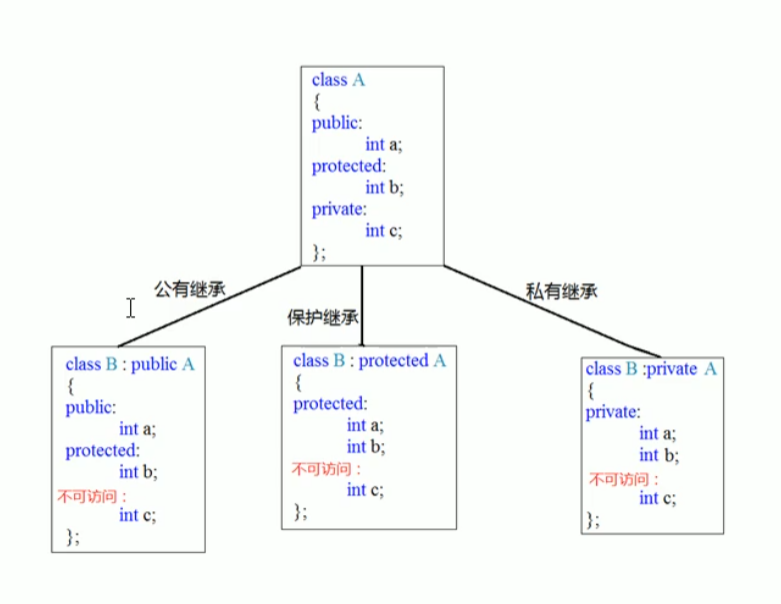

# C++核心编程
本阶段主要针对C++**面向对象**编程技术做详细讲解，探讨C++中的核心和精髓

## 内存分区模型
C++程序在执行时，将内存大方向划分为**四个区域**
 * 代码区: 存放函数体的二进制代码，由操作系统进行管理
 * 全局区: 存放全局变量和静态变量以及常量
 * 栈区: 由编译器自动分配和释放，存放函数的参数值、局部变量等
 * 堆区: 由程序员分配和释放，若程序员不释放，程序结束时由操作系统回收

**意义**: 不同区域存放的数据，赋予不同的生命周期，给我们更大的灵活性

### 程序运行执行前
在程序编译后，生成了exe可执行程序，**未执行该程序**前分为两个区域

**代码区:**
 * 存放cpu执行的机器指令
 * 代码区是**共享**的，共享的目的是对于频繁被执行的程序，只需要在内存中有一份代码即可
 * 代码区是**只读**的，使其只读的原因是防止程序意外地修改了它的指令

**全局区:**
 * 全局变量和静态变量存放在此
 * 全局区还包含了常量区，字符串常量和其他常量也存放在此
 * 该区域的数据在程序结束后由操作系统释放
  
```c++
int g_a = 10;
const int g_c_a = 10;
static int g_s_a = 10;
string g_s = "hello world!";

int main() {

    int l_a = 10;
    const int l_c_a = 10;
    static int l_s_a = 10;
    string l_s = "Hello World!";

    cout << "局部变量地址为: " << &l_a << endl;
    cout << "局部常量地址为: " << &l_c_a << endl;
    cout << "局部静态变量地址为: " << &l_s_a << endl;
    cout << "局部字符串常量地址为: " << &l_s << endl;

    cout << "全局变量地址为: " << &g_a << endl;
    cout << "全局常量地址为: " << &g_c_a << endl;
    cout << "全局静态变量地址为: " << &g_s_a << endl;
    cout << "全局字符串常量地址为: " << &g_s << endl;
    system("pause");

    return 0;
}
```

### 程序运行后
**栈区:**
 * 由编译器自动分配释放，存放函数的参数值，局部变量等
 * 注意事项: 不要返回局部变量的地址，栈区开辟的数据由编译器自动释放

```c++
int * func() {
    //局部变量存放在栈区
    //栈区的数据在函数执行完后自动释放
    int a = 10; 
    return &a;
}

int main() {

    int *p = func();
    
    cout << *p << endl; //第一次可以打印正确的数字，编译器做了保留
    cout << *p << endl; //第二次不做保护

    return 0;
}
```

**堆区:**
 * 由程序员分配释放，若程序员不释放，程序结束后由操作系统回收
 * 在C++中主要利用new在堆区开辟内存

```c++
int * func() {

    int *a = new int(10);
    return a;
}

int main() {

    int *p = func();

    cout << *p << endl;
    cout << *p << endl;

    return 0;
}
```

### new操作符
C++中利用new操作符在堆区开辟数据

堆区开辟的数据，由程序员手动开辟，手动释放，释放用操作符delete

**语法:** ``new 数据类型``
利用new创建的数据，会返回该数据对应的类型的指针

```c++
int * func() {

    int *p = new int(10);
    return p;
}

void func_() {

    int *arr = new int[10];

    for (int i = 0; i < 10; i++) {

        arr[i] = i*i;
    }

    for (int i = 0; i < 10; i++) {

        cout << arr[i] << endl;
    }

    delete[] arr;
}

int main() {

    int *p = func();

    //堆区的数据由程序员开辟和释放
    cout << *p << endl;
    cout << *p << endl;
    delete p;
    cout << *p << endl;

    func_();

    return 0;
}
```

## 引用
### 引用的基本使用
**作用:** 给变量起别名

**语法:** ``数据类型 &别名 = 原名``
```c++
int main() {

    int a = 10;
    int &b = a;

    cout << "a = " << a << endl;
    cout << "b = " << b << endl;

    b = 100;

    cout << "a = " << a << endl;
    cout << "b = " << b << endl;

    return 0;
}
```

### 引用注意事项
 * 引用必须初始化
 * 引用在初始化后，不可以改变

```c++
int main() {

    int a = 10;
    int b = 20;
    // int &c; //错误，引用必须初始化
    int &c = a; //一旦初始化后，就不可以更改
    c = b;

    cout << "a = " << a << endl;
    cout << "b = " << b << endl;
    cout << "c = " << c << endl;

    return 0;
}
```

### 引用做函数参数
**作用:** 函数传参时，可以利用引用技术让形参修饰实参

**优点:** 可以简化指针修改实参

```c++
//1.值传递
void mySwap1(int a, int b) {
    int temp = a;
    a = b;
    b = temp;
}

//2.地址传递
void mySwap2(int *a, int *b) {
    int temp = *a;
    *a = *b;
    *b = temp;
}

//3.引用传递
void mySwap2(int &a, int &b) {
    int temp = a;
    a = b;
    b = temp;
}

int main() {

    int a = 10;
    int b = 20;

    mySwap(a, b);

    cout << a << endl;
    cout << b << endl;

    return 0;
}
```

### 引用做函数的返回值
**作用:** 引用是可以作为函数的返回值存在的

**注意:** **不要返回局部变量引用**

**用法:** 函数调用作为左值

```c++
//返回局部变量引用
int & test1() {
    // 局部变量存放在栈区，函数运行结束自动释放
    int a = 10;
    return a;
}

//返回局静态变量引用
int & test2() {
    // 静态变量存放在全局区，程序结束后系统释放
    static int a = 10;
    return a;
}

int main() {

    int &ref1 = test1();

    cout << ref1 << endl; //第一次结果正确，编译器做了保留
    cout << ref1 << endl; //第二次结果错误

    int &ref2 = test2();
    test2() = 1000;

    cout << ref2 << endl;
    cout << ref2 << endl;

    return 0;
}
```

### 引用的本质
**本质:**引用的本质在C++内部实现是一个之指针常量
```c++
//发现是引用，转化为int* const ref = &a;
void func(int &ref) {
    ref = 100; //ref是引用，转化为*ref = 100
}

int main() {

    int a = 10;
    //自动转化为 int * const ref = &a;
    int &ref = a;
    ref = 20; //内部发现ref是引用，自动帮我们转化为: *ref = 20;
    
    cout << "a:" << a << endl;
    cout << "ref:" << ref << endl;

    func(a);

    return 0;
}
```

### 常量引用

**作用:**常量引用主要用来修饰形参，防止误操作

在函数形参列表中，可以加const修饰形参，防止形参改变实参

```c++
//引用使用的场景，通常用来修饰形参
void showValue(const int& v) {
    // v += 10;
    cout << v << endl;
}

int main() {
    //int &ref = 10; 引用本身需要一个合法的内存空间，因此这行错误
    //加入const就可以了, 编译器优化代码
    //int temp = 10; const int &ref = temp;
    const int &ref = 10;

    int v = 1;
    showValue(v);

    return 0;
}
```

## 函数提高
### 函数默认参数

在C++中，函数的形参列表中的形参是可以有默认值的

**语法:** ``返回值类型 函数名 (参数 = 默认值) {}``

```c++
int func(int a, int b, int c = 10) {
    return a + b + c;
}

//1. 如果某个位置参数有默认值，那么从这个位置往后，从左向右，必须要有默认值
//2. 如果函数声明有默认值，函数定义的时候就不能有默认参数
int func2(int a = 10, int b = 10);
int func2(int a, int b) {
    return a + b;
}

int main() {

    cout << func(10, 30) << endl;

    return 0;
}
```

### 函数的占位参数
C++中函数的形参列表里可以有占位参数,用来做占位，调用函数时必须填补该位置

**语法:** ``返回值类型 函数名 (数据类型) {}``
```c++
//函数占位参数，占位参数也可以有默认参数
void func(int a , int) {

    cout <<< "this is func" <<endl;
}

int main() {

    func(10, 10); //占位参数必须被填补

    return 0;
}
```

### 函数重载
**作用:** 函数名可以相同，提高复用性
**函数重载满足条件:**
 * 同一个作用域下
 * 函数名称相同
 * 函数参数**类型**不同 或者 **个数**不同 或者 **顺序**不同

**注意:** 函数的返回值不可以作为函数重载的条件
```c++
//函数重载需要函数都在同一个作用域下
void func() {
    cout << "func 的调用！" << endl;
}

void func(int a) {
    cout << "func(int a) 的调用！" << endl;
}

void func(double d) {
    cout << "func(double d) 的调用！" << endl;
}

void func(int a, double d) {
    cout << "func(int a, double d) 的调用！" << endl;
}

void func(double d, int a) {
    cout << "func(double d, int a) 的调用！" << endl;
}

int main() {

    func();
    func(10);
    func(10.23);
    func(10, 23.2);
    func(23.2, 10);
    return 0;
}
```

**注意:**
 * 引用作为重载条件
 * 函数重载碰到默认参数

```c++
//函数重载注意事项
//1. 引用作为重载条件
void func(int &a) {

    cout << "func (int &a)调用" << endl;
}

void func(const int &a) {
    
    cout << "func (const int &a)调用" << endl;
}

//2. 函数重载遇到默认参数
void func2(int a, int b = 10) {
    
    cout << "func2(int a)调用" << endl;
}

void func2(int a) {
    
    cout << "func2(int a = 10)调用" << endl;
}


int main() {

    int a = 10;
    func(a);

    //调用第二个
    func(10);

    func2(a);
    func2(a); //出现二义性

    return 0;
}
```

## 类和对象

C++ 面向对象的三大特性为: 封装、继承、多态

### 封装
**意义:**
 * 将属性和行为作为一个整体，表现生活中的事务
 * 将属性和行为加以权限控制

**语法:** ``class 类名{ 访问权限: 属性 /行为 };``

```c++
//圆周率
const double PI = 3.14;

class Circle {

    public: 
        double r;

        double calculateZC() {
            erturn 2 * PI * r;
        }
};


int main() {

    Circle c;
    c.r = 10;

    cout << "圆的周长为: " << c.calculateZC() << endl;

    return 0;
}
```

```c++

class Student {

    public:
        //成员变量
        int m_Id;
        string name;

        //成员方法
        void setId(int id) {
            m_Id = id;
        }

        void setName(string name) {
            m_Name = name;
        }

        void showStu() {

            cout << id << " : " << name << endl;        
        }
};
```

类在设计时，可以把属性和行为放在不同的权限下，加以控制:
 * public 公共权限
 * protected 保护权限
 * private 私有权限

```c++
//public    成员 类内可以访问，类外可以访问
//protected 成员 类内可以访问，类外不可以访问, 子类也可以访问
//private   成员 类内可以访问，类外不可以访问

class Person {

    public:
        string name;
    
    protected:
        string car;
    
    private:
        string password;

};
```

#### struct 和 class 区别
在C++中struct和class唯一的区别就在于默认的访问权限不同

**区别:**
 * struct 默认权限为公共
 * class 默认权限为私有

```c++
class C1 {

    int a;
};

struct C2 {

    int a;
};

int main() {

    C1 c1;
    c1.a = 100; //报错。默认权限为私有

    C2 c2;
    c2.a = 100;
}
```

#### 成员属性的私有化

**优点:**
 * 将所有成员属性设置为私有，可以自己控制读写权限
 * 对于写权限，我们可以监测数据的有效性

```c++
class Person {

private:

    string m_Name;

public:

    void setName(string name) {
        m_Name = name;
    }
    
    string getName() {
        return m_Name;
    }
};

int main() {

    Person p;
    p.setName("张三");
    cout << p.getName() << endl;;
}
```

### 构造函数和析构函数
对象的**初始化和清理**是两个非常重要的安全问题

    一个对象或者变量没有初始状态，对其使用的后果是未知的

    同样的使用完一个对象或变量，没有及时清理，也会造成一定的安全问题

C+++使用构造函数和析构函数解决上述问题，这两个函数会被编译器自动调用，完成对象初始化和清理工作。

对象的初始化和清理工作是编译器强制我们做的事情，如果我们不提供构造和析构函数，编译器会提供的是这两个函数的空实现。

 * 构造函数: 主要作用在于创建对象时为对象的成员属性赋值，构造函数由编译器自动调用，无需手动调用。
 * 析构函数: 主要作用在于对象销毁前系统自动调用，执行一些清理工作。

**构造函数语法:** ``类名(){}``
 * 构造函数，没有返回值，也不写void
 * 函数名称和类名相同
 * 构造函数可以有参数，因此可以发生重载
 * 程序在调用对象时候会自动调用一次构造，无需手动调用

**析构函数语法:** ``~类名（）{}``
 * 析构函数，没有返回值也不写void
 * 函数名称与类名相同，在名称前加上符号 ~
 * 析构函数不可以有参数，因此不可以发生重载
 * 程序在对象销毁前会自动调用一次析构，而无需手动调用

```c++
class Person {

public:

    Person() {
        cout << "Person() 被调用了" << endl;
    }

    ~Person() {
        cout << "~Person() 被调用了" << endl;
    }

};

void test() {

    Person p1;
}

int main() {
    
    //局部变量存于栈区，函数执行完毕就会释放
    //test();

    Person p;

    system("pause");

    return 0;
}
```
### 构造函数的分类及调用
两种分类方式:
 * 按参数分为: 有参构造和无参构造
 * 按类型分为: 普通构造和拷贝构造

三种调用方式:
 * 括号法
 * 显示法
 * 隐式转换法

```c++
class Person {

public:

    Person() {
        cout << "无参构造函数被调用了" << endl;
    }

    Person(int a) {
        cout << "有参构造函数被调用了" << endl;
    }

    //将传入的所有属性进行拷贝
    Person(const Person &p) {
        cout << "拷贝构造函数被调用了" << endl;
    }

};

int main() {

    //1. 括号法
    Person p1;
    Person p2(10);
    Person p3(p2);

    //注意事项
    //调用默认构造函数时候，不要加()，否则编译器会认为这是一个函数的声明，不会认为在创建对象

    //2. 显示法
    Person p4;
    Person p5 = Person(10);
    Person p6 = Person(p5);

    Person(10); //匿名对象，特点:当前行结束后，系统会立即回收掉匿名对象

    //注意事项
    //不要使用拷贝构造函数，初始化匿名对象，编译器会认为 Person(p3) === Person p3; 对象声明

    //3.隐式转化法
    Person p7 = 10;
    Person p8 = p7;

    system("pause");

    return 0;
}
```

### 拷贝函数的调用时机
C++中拷贝构造函数调用时机通常有三种情况
 * 使用一个已经创建完毕的对象来初始化一个新对象
 * 值传递的方式给函数参数传值
 * 以值方式返回局部对象

```c++
class Person {

public:

    Person() {
        cout << "无参构造函数" << endl;
        m_Age = 0;
    }

    Person(int age) {
        cout << "有参构造函数" << endl;
        m_Age = age;
    }

    Person(const Person &p) {
        cout << "拷贝构造函数" << endl;
        m_Age = p.m_Age;
    }

    ~Person() {
        cout << "析构函数调用" << endl;
    }
};

//1. 使用一个已经创建完毕的对象来初始化一个新对象
void test01() {

    Person p1(20);
    Person p2(p1);

    cout << "p2的年龄: " << p2.m_Age << endl;
}

//2. 值传递的方式给函数参数传值
void doWork(Person p) {

    cout << "doWork 年龄: " << p.m_Age << endl;
}
void test02() {

    Person p;
    doWork(p);
}

//3. 值方式返回局部对象
void func() {

    Person p;
    return p;
}
void test03() {

    Person p = func();
}

int main() {

    test01();
    test02();
    test03();

    return 0;
}
```

### 构造函数调用规则
默认情况下，C++编译器至少给一个类添加三个函数
 * 默认构造函数
 * 默认析构函数
 * 默认拷贝函数，对属性进行值拷贝

构造函数的调用规则如下:
 * 如果用户定义有参构造函数，C++不在提供默认无参构造，但是会提供默认拷贝构造
 * 如果用户定义拷贝构造函数，C++不在提供其他构造函数


### 深拷贝与浅拷贝
**浅拷贝:** 简单的复制拷贝操作，导致堆区的内存重复释放

**深拷贝:** 在堆区重新申请空间，进行拷贝操作
```c++
class Person {
public:

    Person() {
        cout << "无参构造函数！" << endl;
    }

    Person(int age, int height) {
        m_Age = age;
        m_Height = new int(height);
        cout << "有参构造函数！" << endl;

    }

    //需要自己实现拷贝构造函数，解决浅拷贝带来的问题
    Person(const Person &p) {
        //编译器的默认实现
        m_Age = p.m_Age;
        //m_Height = p.m_Height;

        //深拷贝
        m_Height = new int(*p.m_Height);
        cout << "拷贝构造函数！" << endl;
    }

    ~Person() {
        //析构函数，将堆区的数据进行释放
        if (m_Height != NULL) {

            delete m_Height;
            m_Height = NULL:
        }
        cout << "析构函数！" << endl;
    }

    int m_Age;
    string *m_Height;
};

void test01() {

    Person p1(18, 160);
    cout << "p1的年龄为: " << p1.m_Age << "p1的身高为: " << *p1.m_Height << endl;

    Person p2(p1));
    cout << "p2的年龄为: " << p2.m_Age << "p2的身高为: " << *p2.m_Height << endl;
}
```

### 初始化列表
**作用:** C++提供了初始化列表语法，用来初始化属性

**语法:** ``构造函数(): 属性1(值1), 属性2(值2) ... {}``

```c++
class Person {
public:

    Person(int a, int b, int c) {
        m_A = a;
        m_B = b;
        m_C = c;
    }

    //初始化列表初始化属性
    Person(int a, int b, int c): m_A(a), m_B(b), m_C(c) { }

    //传统方式初始化
    int m_A;
    int m_B;
    int m_C;
};

void test01() {

    Person p(10, 20, 30);
    cout << p.m_A << p.m_B << p.m_C << endl;
}

int main() {

    test01();
    return 0;

}
```

### 类对象作为类成员
C++类中的成员可以是另一个类的对象，我们称该对象为对象成员

 * 当类中成员是其他类对象时，我们称该成员为对象成员
 * 构造的顺序是: 先调用对象成员的构造，在调用本类构造
 * 析构顺序和构造顺序相反

```c++
class A {};

class B {

    //先被构建
    A a;
};
```

### 静态成员
静态成员就是在成员变量和成员函数前加上关键字static, 称为静态成员

静态成员分为: 
 * 静态成员变量
   * 所有对象共享同一份数据
   * 在编译阶段分配内存
   * 类内声明，类外初始化


* 静态成员函数
  * 所有对象共享同一个函数
  * 静态成员函数只能访问静态成员变量

```c++
class Person {

public:

    static void func(){

        m_A = 100;
        m_B = 200; //错误，静态成员函数不可以访问非静态成员变量
        cout << "静态成员函数!" << endl;
    }

    static int m_A;
    int m_B;
};

void test01() {

    //1. 通过对象访问
    Person p;
    p.func();

    //2. 通过类名
    Person::func();
}
```

### 成员变量和成员函数分开存储
在C++中，类内的成员变量和成员函数分开存储

只有非静态成员变量才属于类的对象上

```c++
class Person {

    int m_A; //非静态变量，属于类的对象

    static int m_B; //静态变量，属于类对象

    void func() { } //非静态成员函数，不属于类的对象

    static void func() { } //静态成员函数，不属于类的对象
};

int main() {

    Person p;

    //空对象占用一个字节空间，为了区分空对象占内存的位置
    cout << "size of p = " << sizeof(p) << endl;
    return 0;
}
```

### this 指针
C++中成员变量和成员函数是分开存储的

每一个非静态成员只会诞生一份函数实例，也就是说多个同类型的对象会共用一块代码

那么问题是:这一块代码如何区分哪个对象调用自己呢?

C++通过提供特殊的对象指针, this指针,解决上述问题。this指针指向被调用的成员函数所属的对象

this指针是隐含每一个非静态成员函数内的一种指针

this指针不需要定义，直接使用即可

this 指针用途:
 * 当形参和成员变量同名时，可用this指针区分
 * 在类的非静态成员函数中返回对象本身，可以使用``return *this;``

```c++
class Person {
public:

    Person(int age) {
        this->age = age;
    }

    //若返回类型不是引用链式编程将失败
    Person& PersonAddAge(Person &p) {
        cout << this->age <<endl;
        this->age += p.age;
        return *this;
    }

    int age; 
};

int main() {

    Person p1(10);
    Person p2(10);

    //链式编程
    p2.PersonAddAge(p1).PersonAddAge(p1).PersonAddAge(p1);

    cout << "p2 的年龄为:" << p2.age <<endl;
    return 0;
}
```

### 空指针访问成员函数
C++中空指针也是可以调用成员函数，但是也要注意有没有用到this指针

如果用到this指针，需要加以判断保证代码的健壮性

```c++
//空指针访问成员函数

class Person {

public:

    void showClassName() {
        cout << "showClassName()：Person" << endl;
    }

    void showPerson() {
        //提高安全性
        if(this == NULL) {
            return;
        }
        cout << "age = " << m_Age << endl;
    }

    int m_Age;

}

void test01() {

    Person * p = NULL;
    //可以运行
    p->showClassName();

    //访问错误, 传入指针为NULL
    p->showPerson();
}
```

### const修饰成员函数

**常函数:**
 * 成员函数后加const后我们称这个函数为**常函数**
 * 常函数内不可以修改成员属性
 * 成员属性声明时加关键字mutable后，在长函数中依然可以修改

**常对象:**
 * 声明对象前加const称该对象为常对象
 * 常对象只能调用常函数

```c++
//空指针访问成员函数

class Person {

public:

    void showClassName() {
        cout << "showClassName()：Person" << endl;
    }

    // this指针本质是 指针常量 指针的指向是不可以修改的
    //Person * const this;

    //函数括号后加入 const 将this指针修饰为 
    //const Person * const this;
    void showPerson() const {

        m_A = 100; //错误，不可修改成员变量
        m_Height = 150; //成功
        cout << "age = " << m_Age << endl;
    }

    void func() {

    }

    int m_Age;
    mutable int m_Height;
};

void test01() {

    const Person p; //常对象
    // p.m_Age = 100;
    p.m_Height = 200;

    //p.func();  //普通函数可以修改成员属性，因此常对象不可以调用
    p.showPerson();
}
```

### 友元
**作用:** 让一个函数或者类, 访问另一个类中的私有成员

**关键字:** ``friend``

友元的三种实现:
 * 全局函数做友元
 * 类做友元
 * 成员函数做友元

```c++
class Building {

    //goodGay 可以访问Building的私有成员变量
    friend void goodGay(Building *building);
    friend class Parents;

public:

    Building(){
        this->sittingRoom = "客厅";
        this->bedRoom = "卧室";
    }

public:
    string sittingRoom;

private:
    string bedRoom;

};

//全局函数
void goodGay(Building *building) {
    cout << "好基友全局函数 正在访问: " << building->sittingRoom << endl;

    cout << "好基友全局函数 正在访问: " << building->bedRoom << endl;
}

void test01() {

    Building building;
    goodGay(&building);
}

class Parents {

public:

    Building *building;

    void visit();

}

Parents::Parents(){
    building = new Building;
}

//类外成员函数实现
void Parents::visit() {

        cout << "父母类 正在访问: " << building->sittingRoom << endl;

        cout << "父母类 正在访问: " << building->bedRoom << endl;
}

```

```c++
class Building;

class GoodGay {

public: 
    GoodGay();

    Building * building;

    void visit(); //让visit函数可以访问Building中私有成员
    void visit_() //让visit_不可以访问Building中私有成员
};

class Building {

    friend void GoodGay::visit();

public:
    Building();

public:

    string sittingRoom;

private:

    string bedRoom;
};

Building::Building() {
    sittingRoom = "客厅";
    bedRoom = "卧室";
}

GoodGay::GoodGay() {
    building = new Building();
}

void GoodGay::visit() {

    cout << "visit 正在访问: " << building->sittingRoom << endl;

    cout << "visit 正在访问: " << building->bedRoom << endl;
}

void GoodGay::visit_() {
    
    cout << "visit_ 正在访问: " << building->sittingRoom << endl;

    cout << "visit_ 正在访问: " << building->bedRoom << endl;
    
}

```

### 运算符重载
**概念:** 对已有的运算符进行重新定义，赋予其另一种功能，以适应不同的数据类型

**加号运算符重载**
```c++
//成员函数重载
class Person {

public:
    int m_A:
    int m_B:

    Person operator+(Person &p) {

        Person temp;
        temp.m_A = this->m_A + p.m_A;
        temp.m_B = this->m_B + p.m_B;
        return temp;
    }

};

//全局函数重载
Person operator+(Person &p1, Person &p2) {

    Person temp;
    temp.m_A = p1.m_A + p2.m_A;
    temp.m_B = p1.m_B + p2.m_B;
    return temp;
}

void test01() {
    Person p1;
    p1.m_A = 1;
    p1.m_B = 10;

    Person p2;
    p2.m_A = 2;
    p2.m_B = 20;

    Person p3 = p1 + p2;
    cout << p3.m_A << p3.m_B << endl;
}
```

**左移运算符重载**
```c++
class Person{
    friend ostream & operator<< (ostream& cout, Person &p);

public:
    Person(int a, int b){
        this.m_A = a;
        this.m_B = b;
    }
    
    //不会使用成员函数重载左移运算符， 因为无法实现cout在左侧
    // void operator<<(Person &p) {

    // }

private:
    int m_A:
    int m_B;
};

ostream & operator<< (ostream &cout, Person p) {
    
    cout << "m_A" << p.m_A << "m_B" << p.m_B;
    return cout
}

void test01(){

    Person p(10, 12);

    cout << p << endl;
}
```

**递增运算符重载**
```c++
class MyInteger {

    friend ostream & operator << (ostream & out, MyInteger myint);

public:
    MyInteger() {
        m_Num = 0;
    }

    //前置++
    MyInteger & operator++() {
        
        //先++
        m_Num++;
        //再返回
        return *this;
    }

    //后置++
    MyInteger operator++(int) {
        
        //先 记录结果
        MyInteger temp = *this;
        //后 递增
        m_Num++;
        //再返回
        return temp;
    }

private:
    int m_Num;

};

ostream & operator<< (ostream &cout, MyInteger myint) {
    
    cout << myint.m_Num;
    return cout
}

void test01(){

    MyInteger integer;

    cout << ++integer << endl;
}
```

**赋值运算符重载**

C++编译器至少给一个类型添加4个函数
 * 默认构造函数
 * 默认析构函数
 * 默认拷贝函数，对属性进行值拷贝
 * 赋值运算符 operator=, 对属性进行值拷贝

```c++
class Person {

public:

    Person(int age) {
        m_Age = new int(age);
    }

    ~Person() {
        if (m_Age != NULL) {
            delete m_Age;
            m_Age = NULL;
        }    
    }

    Person & operator=(Person &p) {

        //先判断是否有属性在堆区，如果有先释放干净，然后深拷贝
        if (m_Age != NULL) {
            delete m_Age;
            m_Age = NULL;
        }
        m_Age = new int(*p.m_Age);
        return *this;
    }

    int *m_Age;
}

void test01(){

    Person p1(10);
    Person p2(20);
    Person p3(30);

    p3 = p2 = p1;

    cout << *p1.m_Age << endl;
    cout << *p2.m_Age << endl;
}
```

**关系运算符重载**
```c++
class Person{

public:
    Person(string name, int age) {
        this->m_Name = name;
        this->m_Age = age;
    };

    bool operator==(Person & p){
        
        if (this->m_Name == p.m_Name && this->m_Age == p.m_Age) {
            return true;
        } 
        return false;
    }

    bool operator<(Person & p){
        
        if (this->m_Name < p.m_Name && this->m_Age < p.m_Age) {
            return true;
        } 
        return false;
    }
} 
```

**函数调用运算符重载**
 * 函数调用运算符() 也可以重载
 * 由于重载后使用的方式非常像函数的调用，因此称为仿函数
 * 仿函数没有固定的写法，非常灵活

```c++
class MyPrint{

public:
    void operator()(string text) {
        cout << text <<endl;
    }
};

class MyAdd{

public:
    int operator()(int a, int b) {
        return a + b;
    }
};

void test01() {

    MyPrint myFunc;
    myFunc("Hello World!");
    cout << MyAdd()(19, 23) << endl;
}
```


### 继承
**语法:** ``class 子类: 继承方式 父类``

**继承方式:**
 * 公共继承
 * 保护继承
 * 私有继承



**继承中的对象模型**
```c++
class Base {

    public:
        int m_A;

    protected:
        int m_B;

    private:
        int m_C;
};

class Son : public Base {

    public:
        int m_D;
};

void test01() {
    // 16
    // 父类中所有非静态成员属性都会被子类继承下去
    // 父类中私有成员属性 被编译器给隐藏了，因此访问不到
    cout << "size of Son" << sizeof(Son) << endl;
}
```

**继承中的构造和析构顺序**
```c++
class Base {

    public:
        Base() {
            cout << "Base构造函数！">>
        }

        ~Base() {
            cout << "Base析构函数！">>
        }
};

class Son : public Base {

    public:
        Son() {
            cout << "Son构造函数！">>
        }

        ~Son() {
            cout << "Son析构函数！">>
        }
};

void test01() {

    Son son;
}
```
**继承同名成员函数处理方式**

当子类与父类出现同名的成员，如何通过子类对象，访问到子类或父类中同名的数据呢?

 * 访问子类同名成员 直接访问即可
 * 访问父类同名成员 需要加作用域

```c++
class Base {

    public:
        Base() {
            m_A = 100;
        }

        void func() {
            cout << "base func()" << endl;
        }

        void func(int a) {
            cout << "base func()" << endl;
        }

        int m_A;
};

class Son : public Base {

    public:
        Son() {
            m_A = 200;
        }

        void func() {
            cout << "son func()" << endl;
        }

        int m_A;
};

void test01() {

    Son son;
    cout << son.m_A << endl;
    cout << son.Base::m_A << endl;

    son.func();
    son.Base::func();

    // 错误，子类中出现和父类同名函数，子类会隐藏掉父类中所有同名成员函数
    //如果想访问到父类中被隐藏的的同名成员函数，需要加作用域
    son.func(100);
    son.Base::func(100);
}
```

**继承中同名静态成员处理方式**

继承中同名的静态成员在子类对象上如何进行访问?

静态成员和非静态成员出现同名，处理方式一致
 * 访问子类同名成员 直接访问即可
 * 访问父类同名成员 需要加作用域

```c++
class Base {

    public:
        static void func() {
            cout << "base func()" << endl;
        }

        static int m_A;
};
int Base::m_A = 100;

class Son : public Base {

    public:
        static void func() {
            cout << "son func()" << endl;
        }

        static int m_A;
};
int Son::m_A = 200;

void test01() {

    //1.通过对象访问
    Son son;
    cout << son.m_A << endl;
    cout << son.Base::m_A << endl;

    //2.通过类名访问
    cout << Son::m_A << endl;
    cout << Son::Base::m_A << endl;


    son.func();
    son.Base::func();

    Son::func();
    Son::Base::func();
}
```

**多继承语法**

C++允许**一个类继承多个类**

语法: ``class 子类 : 继承方式 父类1， 继承方式 父类2...``

多继承可能会引发父类中有同名成员出现，需要加作用域区分

```c++
class Base1 {

    public:
        Base1() {
            m_A = 100;
        }

        int m_A;
};

class Base2 {

    public:
        Base2() {
            m_A = 200;
        }
        
        int m_A;
};

class Son : public Base1, public Base2 {

    public:
        Son() {
            m_C = 300;
        }

        int m_C;
};

void test01() {

    Son s;

    cout <<sizeof(s) << endl;
    cout << s.Base1::m_A << endl;

}
```

**菱形继承**

**菱形继承概念:**
 * 有两个派生类继承同一个基类
 * 有某个类同时继承了两个派生类

```c++

// 利用虚继承 解决菱形继承存在多个语义重复的父类成员的问题
class Animal() {

public:

    Animal(){
        m_Age = 18;
    }

    int m_Age;

};

// Animal 成为虚基类
class Sheep : virtual public Animal {};

class Tuo : virtual public Animal {};

class SheepTuo : public Sheep, public Tuo {};

void test01() {

    SheepTuo st;

    st.m_Age = 19;
    st.Sheep::m_Age = 18;
    st.Tuo::m_Age = 28;
}
```

### 多态

**多态是C++面向对象三大特性之一**

多态分为两类
 * 静态多态: 函数重载和运算符重载属于静态多态，复用函数名
 * 动态多态: 派生类和虚函数实现运行时的多态

静态多态和动态多态区别:
 * 静态多态的函数地址早绑定 - 编译阶段确定函数地址
 * 动态多态的函数地址晚绑定 - 运行阶段确定函数地址

```c++
//动态多态条件
//1. 有继承关系
//2. 子类重写父类虚函数
//3. 调用时需要将父类的指针指向子类对象

class Animal{

public:
    //虚函数
    virtual void speak() {
        cout << "动物在说话！" <<endl;
    }
};

class Cat: public Animal {

public:
    //重写 函数值返回类型， 函数名称， 函数参数完全相同
    void speak() {
        cout << "小猫在说话！" <<endl;
    }
};

class Dog: public Animal {

public:
    void speak() {
        cout << "小狗在说话！" <<endl;
    }
};

// 地址静态绑定，编译时就确定了函数地址
// 如果执行想让猫说话，需要在运行阶段绑定地址
void doSpeak(Animal &animal) {
    animal.speak();
}

void test01() {

    Cat cat;
    //父类引用指向子类对象
    doSpeak(cat);

    Dog dog;
    doSpeak(dog);
}
```

**纯虚函数和抽象类**

在多态中，通常父类中虚函数的实现是毫无意义的，主要都是调用子类重写的内容，因此可以将虚函数改为**纯虚函数**

**语法:** ``virtual 返回值类型 函数名 (参数列表) = 0``

当类中有了纯虚函数，这个类也被成为抽象类

**特点:**
 * 无法实例化对象
 * 子类必须重写抽象类中的纯虚函数，否则也属于抽象类

```c++

//抽象类
class Animal{

public:
    //纯虚函数
    virtual void speak() = 0;
};

class Cat: public Animal {

public:
    //重写 函数值返回类型， 函数名称， 函数参数完全相同
    void speak() {
        cout << "小猫在说话！" <<endl;
    }
};

void test01() {

    Animal animal; //抽象类无法实例化

    Animal *cat = new Cat;
    cat->speak();

}
```

**虚析构和纯虚析构**

在使用多态时，如果子类中有属性开辟到堆区，那么父类指针在释放时无法调用到子类的析构代码

解决方式: 将父类中的析构函数改为**虚析构**和**纯虚析构**

虚析构和纯虚析构共性:
 * 可以解决父类指针释放子类对象
 * 都需要有具体的函数实现

虚析构和纯虚析构区别:
 * 如果是纯虚析构，该类属于抽象类，无法实例化对象

**虚析构语法:** ``virtual ~类名(){}``

**纯虚析构语法:** ``virtual ~类名() = 0;``

```c++
//抽象类
class Animal{

public:
    Animal() {
        cout << "Animal 构造函数！" << endl;
    }
    
    virtual ~Animal() {
        cout << "Animal 虚析构函数！" << endl;
    }

    //需要有具体实现，否则报错
    virtual ~Animal() = 0;

    //纯虚函数
    virtual void speak() = 0;
};

Animal::~Animal() {
    cout << "Animal 纯虚析构函数！" << endl;
}

class Cat: public Animal {

public:

    Cat(string name) {
        cout << "Cat 构造函数调用！" << endl;
        m_Name = new string(name);
    }

    ~Cat(string name) {
        cout << "Cat 析构函数调用！" << endl;
        delete m_Name;
    }

    void speak() {
        cout << *m_Name << "在说话！" <<endl;
    }

    string m_Name;
};

void test01() {

    Animal *cat = new Cat("Tom");
    cat->speak();

    //父类指针在析构的时候 不会调用子类中析构函数，导致子类如果有堆区属性，出现内存泄漏
    //需要将父类析构函数改为虚析构
    delete cat;

}
```

## 文件操作

程序运行时产生的数据都属于临时数据，程序一旦运行结束都会被释放

通过**文件可以将数据持久化**

C++中对文件操作需要包含头文件 ``<fstream>``

文件类型分为两种:
 * 文本文件 - 文件以文本的ASCII码形式存储到计算机中
 * 二进制文件 - 文件以文本的二进制形式存储在计算机中

操作文件的三大类:
 * ofstream：写操作
 * ifstream: 读操作
 * fstream: 读写操作

### 文本文件
**写文件:**
 * 包含头文件 ``#include<fstream>``
 * 创建流对象 ``ofstream ofs;``
 * 打开文件 ``ofs.open("文件路径", 打开方式);``
 * 写数据 ``ofs << "写入的数据"``
 * 关闭文件 ``ofs.close();``

|打开方式|解释|
|-|-|
|ios::in|为读文件而打开文件|
|ios::out|为写文件而打开文件|
|ios::ate|初始位置:文件尾|
|ios::app|追加方式写文件|
|ios::trunc|如果文件存在先删除,在创建|
|ios::binary|二进制方式|

**注意:**文件打开方式可以配合使用，如``ios::binary | ios::out``

```c++
#include<iostream>
#include<fstream>

using namespace std;

void test01() {
    // 包含头文件 fstream

    //创建流对象

    ofstream ofs;
    ofs.open("test.txt", ios::out);

    ofs << "姓名: 张三" << endl;

    ofs.close();
}
```

```c++
#include<iostream>
#include<fstream>

using namespace std;

void test01() {
    // 包含头文件 fstream
    //创建流对象
    //打开文件判断是否打开成功
    //读数据
    //关闭文件

    ofstream ofs;
    ofs.open("test.txt", ios::in);

    if(!ifs.is_open()) {
        cout << "文件打开失败！"<<endl;
        return;
    }

    char buf[1024] = {0};
    while(ifs >> buf) {
        cout << buf <<endl;
    }

    char buf[1024] = {0};
    while(ifs.getline(buf, sizeof(buf))) {
        cout << buf <<endl;
    }

    string buf;
    while(getline(ifs, buf)) {
        cout << buf <<endl;
    }

    char c;
    while((c = ifs.get() != EOF) {
        cout << c;
    } 


    ofs.close();
}
```
### 二进制文件

```c++
class Person {

public:

    char m_Name[64];
    int m_Age;
};

void test01() {
    
    ofstream ofs;

    //ofstream ofs("person.txt", ios::out | ios::binary);

    ofs.open("person.txt", ios::out | ios::binary);

    Person p = {"张三", 18};
    ofs.write((const char *) &p, sizeof(Person));

    ofs.close();
}
```

```c++
class Person {

public:

    char m_Name[64];
    int m_Age;
};

void test01() {
    
    ofstream ofs;

    //ofstream ofs("person.txt", ios::out | ios::binary);

    ofs.open("person.txt", ios::in | ios::binary);

    if (!ifs.is_open()) {
        cout << "文件打开失败！" <<endl;
        return;
    }

    Person p;
    ofs.read((char *) &p, sizeof(Person));

    cout << p.m_Name << p.m_Age << endl;

    ofs.close();
}
```
